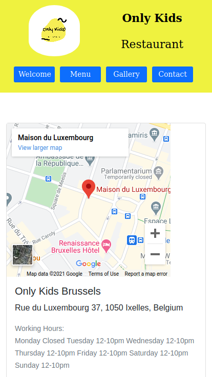

# Welcome to the website of the restaurant "Only Kids"

[Link](https://yuliya-becode.github.io/restaurant-css-framework/welcome.html)

 By creating the website, the following coding languages have been used

 1. html
 2. css
 3. bootstrap (the most popular CSS Framework for developing responsive and mobile-first websites)

    For visual effects I used services such as unsplash and canva.

    The website is considered to be responsive, at least for small and medium screens. Only

    The website consists of five accessible pages: welcome, menu, pictures, restaurants and contact.
    
### Welcome

- A page with one Jumbotron and two panels to show news (promo, events, etc…​).

### Menu

- A page with the restaurant menu in the form of a grouped list with badges.

### Gallery

- A page with a gallery of minimum 10 pictures and a pagination (3 photos per page).
Restaurant

### Restaurants

- A page about the restaurants (it’s a franchise) with its addresses, a map, and different schedules.

### Contact

- A page with a contact form containing the firstname, lastname, email, subject of the message (a drop-down list with multiple options), an area for the message itself and a send button with an icon. Each entry as a title in a semantically correct tag.

## At the first stage, I created my design in Figma. 

Please find here below an appropriate maket for my webpage.

